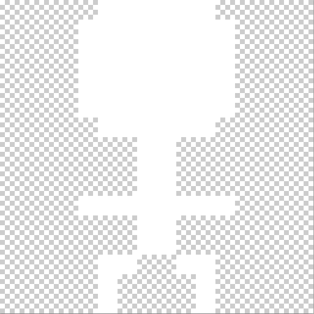
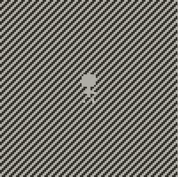
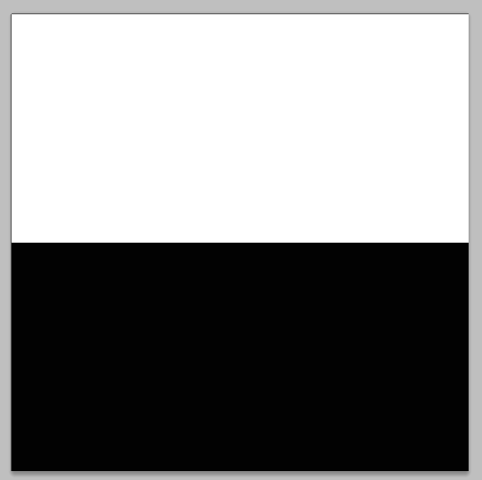
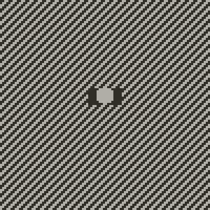
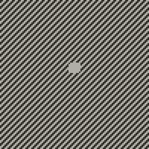

# actualMask
adds the ability to set an actual image Mask on Playdate -- an image mask that behaves like what is expected from an image mask

(works similar to masking in unity/cocos/photoshop or any other software that has masks)

# problem
although playdate SDK images support image masking with the method [setMaskImage][(https://didier.malenfant.net/toybox.py/)](https://sdk.play.date/inside-playdate/#m-graphics.image.setMaskImage), there seems to be a problem -- it will override the resulting masked-image with black even if the souce of the image is transparent

# solution

let's start by having a simple stickman being drawn in front of a diagonal pattern




```lua
img = gfx.image.new('assets/images/stickman')

function playdate.update()
	gfx.setDitherPattern(.5, gfx.image.kDitherTypeDiagonalLine)
	gfx.fillRect(0, 0, 100, 100)
	img:draw(42, 42)
end
```



Simple and Clean. Now Lets try to add a mask to it that will cover only its head. remember that white means draw, black means do not draw.



```lua
mask = gfx.image.new('assets/images/mask')
img:setMaskImage(mask)
```


So what happened? Although the body and feet from the stickman are not drawn as expected, there is now a black background to the head! We do not want that, since the source image did not have any pixels set there.

Why does this happen? No Idea. But thats not what I expect from masking at all, that is for sure.

Now lets use the magic function setAnActualMaskToImage

```lua
mask = gfx.image.new('assets/images/mask')
setAnActualMaskToImage(img, mask)
```



Awesome! this is how masks are supposed to work!

# how Does actualMask work?
